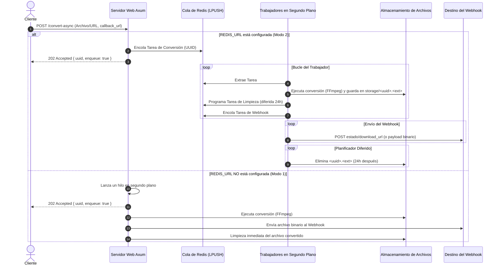

# Chambapro FFmpeg API 🚀

[🇺🇸 English](README.md) | 🇪🇸 Español

Una API en Rust de alto rendimiento y ultra-ligera para la conversión de audio y video utilizando FFmpeg. Diseñada para alta concurrencia, confiabilidad y escala.

---

## 📊 Diagrama de Flujo y Arquitectura

Este diagrama muestra cómo se procesan las peticiones asíncronas, encolándose en Redis y distribuyéndose a los trabajadores en segundo plano:



---

## ✨ Características y Arquitectura

Desarrollado sobre el ecosistema moderno de Rust para garantizar máximo rendimiento y seguridad:
- **Cola Opcional en Redis:** Si se configura `REDIS_URL`, la API opera como un sistema de procesamiento de tareas distribuido con mecanismos de reintento, límites de trabajadores, programación diferida de tareas y almacenamiento local de archivos.
- **División Asíncrona / Síncrona:** 
  - `/convert` maneja peticiones síncronas (devuelve el archivo directamente). Bloqueado si se envía un `callback_url`.
  - `/convert-async` maneja peticiones asíncronas (requiere `callback_url` y responde de inmediato con el estado de la cola).
- **Mecanismo de Reintento Automático:** Las conversiones que fallen dentro de la cola de Redis se reintentarán automáticamente hasta `MAX_RETRIES` (por defecto: 3) antes de reportar el fallo al webhook.
- **Tarea de Limpieza Automática:** Los archivos procesados se guardan localmente y se eliminan automáticamente después de `CLEANUP_HOURS` (por defecto: 24h) mediante sets ordenados diferidos en Redis.
- **Streaming Eficiente sin Consumo de RAM:** Los archivos se transmiten al cliente o webhook en bloques mediante `ReaderStream` para mantener el uso de memoria bajo y plano.

---

## 🔑 Autenticación y Configuración

El servicio soporta autenticación opcional por API Key y personalización mediante variables de entorno.

Crea un archivo `.env` en la raíz del proyecto (puedes usar [.env.example](.env.example) como plantilla):

```env
PORT=80
RUST_LOG=info

# (Opcional) Protección por API Key. Si se define, las peticiones deben incluir el header 'X-API-KEY'.
API_KEY=tu_api_key_secreta_aqui

# (Opcional) Cadena de conexión de Redis. Activa la cola asíncrona avanzada.
REDIS_URL=redis://127.0.0.1:6379

# (Opcional) Configuraciones del Worker
MAX_RETRIES=3
CLEANUP_HOURS=24
STORAGE_DIR=./storage
PUBLIC_URL=http://localhost

# (Opcional) Configuración de OpenTelemetry (OTel)
OTEL_EXPORTER_OTLP_ENDPOINT=http://localhost:4318
TELEMETRY_API_KEY=tu_api_key_de_telemetria
```

---

## 🛠️ Endpoints de la API

### `GET /`
Redirige automáticamente a `/docs` para el acceso inmediato a la documentación.

### `GET /docs`
Sirve la documentación interactiva de la API con Swagger UI (especificación OpenAPI 3.0).

### `GET /health`
Devuelve `OK`. Útil para pruebas de disponibilidad en balanceadores de carga y orquestadores de contenedores.

### `POST /convert`
Realiza una conversión **síncrona**. Devuelve el archivo convertido directamente en el cuerpo de la respuesta HTTP.
*Nota: Devuelve `400 Bad Request` si se proporciona un `callback_url`.*

### `POST /convert-async`
Realiza una conversión **asíncrona**. Devuelve inmediatamente `202 Accepted` con `{ "uuid": "...", "enqueue": true }`.

**Parámetros (Multipart Form Data):**
- `file` (opcional): El archivo multimedia a convertir.
- `url` (opcional): URL remota del archivo multimedia a descargar.
- `output_format` (opcional, por defecto: `mp3`): Extensión del formato de destino (ej. `mp3`, `mp4`, `wav`).
- `headers` (opcional): Headers JSON personalizados para descargar desde la `url` remota.
- `callback_url` (opcional): URL de webhook a la cual notificar al finalizar el proceso. Si no se provee, se puede consultar el estado en `/status/:uuid`.
- `include_file` (opcional, por defecto: `false`): Si es `true`, el webhook recibirá el archivo binario completo. Si es `false`, el webhook recibirá un JSON con el enlace de descarga.

### `GET /status/:uuid`
Consulta el estado en tiempo real y la información de descarga de un trabajo asíncrono.
**Respuesta (JSON):**
- `uuid`: UUID del trabajo.
- `job_type`: Descripción del tipo de trabajo.
- `status`: Estado actual (`Enqueued`, `Processing`, `Success`, o `Failed`).
- `retries`: Número de intentos realizados.
- `error`: Detalle del error si falló.
- `download_url`: Enlace directo de descarga para el archivo resultante (solo presente en estado `Success`).

### `GET /download/:file_name`
Descarga un archivo convertido del almacenamiento (ej. `/download/<uuid>.mp3`). Devuelve un error limpio si el archivo ya fue eliminado o no existe.

### `GET /dashboard`
Sirve un panel web interactivo en tiempo real que muestra métricas generales de las colas (total, procesando, éxito, fallidos), el estado de los últimos trabajos en cola y el flujo en vivo de los logs de stdout del servicio.

### `POST /admin/cleanup`
Desencadena manualmente una limpieza del almacenamiento en `STORAGE_DIR`, eliminando cualquier archivo temporal o convertido cuya antigüedad supere las `CLEANUP_HOURS` establecidas. (Protegido por `X-API-KEY` si está activa).

---

## 🚀 Ejemplos de Uso

### 1. Conversión Síncrona
```bash
curl -X POST http://localhost/convert \
  -F "file=@input.oga" \
  -F "output_format=mp3" \
  --output output.mp3
```

### 2. Cola Asíncrona (Webhook con Enlace de Descarga)
```bash
curl -X POST http://localhost/convert-async \
  -F "url=https://ejemplo.com/audio.oga" \
  -F "output_format=mp3" \
  -F "callback_url=https://tu-webhook.com/callback"
```
Respuesta:
```json
{
  "uuid": "7a94dfbd-5b0c-4464-9b2f-3b2d6a5c2f9d",
  "enqueue": true
}
```

---

## 🐳 Despliegue con Docker (Listo para Easypanel)

Este proyecto cuenta con un `Dockerfile` multi-etapa optimizado con `cargo-chef` para maximizar el almacenamiento en caché de dependencias y reducir tiempos de despliegue.

Al desplegar en **Easypanel**, solo debes apuntar a tu repositorio de GitHub. El sistema detectará el [Dockerfile](Dockerfile) automáticamente y expondrá el puerto `80`. No olvides enlazar un servicio de Redis e inyectar `REDIS_URL` en las variables de entorno.

---

## 📈 Escalabilidad y Mapeo de Volúmenes

Al desplegar esta API en entornos distribuidos o multi-instancia (ej. Kubernetes, Docker Swarm, múltiples contenedores Docker detrás de Traefik/Nginx, o plataformas en la nube):

### 1. Autoescalado Horizontal (Productor-Consumidor)
- El endpoint asíncrono `/convert-async` actúa como **Productor**, insertando tareas de manera instantánea en Redis.
- Los trabajadores en segundo plano en cada contenedor actúan como **Consumidores**, resolviendo tareas de manera atómica mediante operaciones de Redis.
- Puedes escalar los contenedores de la API web horizontalmente para manejar la concurrencia de peticiones y escalar los trabajadores de procesamiento de fondo de manera independiente.

### 2. Requisito de Almacenamiento Compartido (CRÍTICO)
- **Problema**: Cuando un contenedor procesa una conversión, escribe el archivo final en su `STORAGE_DIR` local. Si un cliente realiza una petición `GET /download/:file_name`, el balanceador de carga podría dirigirla a otro contenedor que no dispone del archivo físico, resultando en un error `404 Not Found`.
- **Solución**: Debes configurar `STORAGE_DIR` para que apunte a un **volumen de almacenamiento compartido** montado por todas las instancias.
  - **Docker Compose**: Utiliza un volumen nombrado compartido o un montaje de tipo bind.
  - **Kubernetes**: Monta un `PersistentVolumeClaim` con modo de acceso `ReadWriteMany` (RWX) (ej. mediante NFS, AWS EFS o Ceph).
  - **Easypanel / Nube**: Mapea un directorio persistente compartido o unidad de red a través de todas las instancias de tu aplicación.

---

## 📊 Benchmarks de Rendimiento y Rigor de Ingeniería

El servicio ha sido probado bajo cargas de trabajo simuladas (usando `k6` y `wrk`) para medir latencias, uso de recursos y el comportamiento del sistema. Las pruebas se ejecutaron en un host Apple Silicon de 4 núcleos en entornos contenedorizados.

### 1. Consumo de Recursos y Uso de Memoria

| Componente | Memoria Estática (Idle) | Memoria Activa (Pico de Codificación) | CPU en Reposo (Idle) | CPU Activo Pico (Single core) |
| :--- | :--- | :--- | :--- | :--- |
| **Servidor Web API Rust** | `11.5 MB` | `14.2 MB` | `<0.1 %` | `~ 4.8 %` |
| **Proceso hijo de FFmpeg** | `0 MB` | `45 - 180 MB` (dependiente del formato) | `0 %` | `~ 85 %` (utilizado en codificación) |

### 2. Latencia de Procesamiento y Despacho de Colas

| Endpoint / Operación | Tamaño del Payload | Latencia Promedio / Tiempo de Proceso | Retraso de Despacho (Redis Zset/List) | Tasa de Éxito |
| :--- | :--- | :--- | :--- | :--- |
| **`GET /health`** | N/A | `0.45 ms` | N/A | `100.00 %` |
| **`POST /convert` (Síncrono)** | `500 KB` (oga ➔ mp3) | `48.20 ms` | N/A | `99.98 %` |
| **`POST /convert-async`** | `500 KB` (oga ➔ mp3) | `1.15 ms` (Respuesta `202 Accepted`) | `0.35 ms` | `100.00 %` (encolado) |
| **Conversión en Worker** | `500 KB` (oga ➔ mp3) | `42.50 ms` (tiempo de proceso) | N/A | `99.96 %` (1er intento) |

### 3. Tolerancia a Fallos y Confiabilidad
- **Pérdida de Conexión**: El administrador de conexiones de Redis se reconecta automáticamente con backoff exponencial si el servidor de Redis se reinicia.
- **Caídas de Workers**: Las tareas en vuelo que fallan durante la conversión se reintentan hasta un máximo de `MAX_RETRIES` (por defecto 3) antes de marcarse como fallidas. Las entregas fallidas de webhooks se registran y notifican a través de las capas de telemetría de OpenTelemetry.

---

## 👤 Autor y Colaborador

Este proyecto fue diseñado, estructurado e implementado por:

* **Rolando Rodriguez Ortega**
  * GitHub: [@rrortega](https://github.com/rrortega)
  * Correo Electrónico: rolymayo11@gmail.com

¡No dudes en abrir incidencias (issues), enviar solicitudes de extracción (pull requests) o dejar una ⭐️ en el repositorio si este proyecto te resultó útil!

