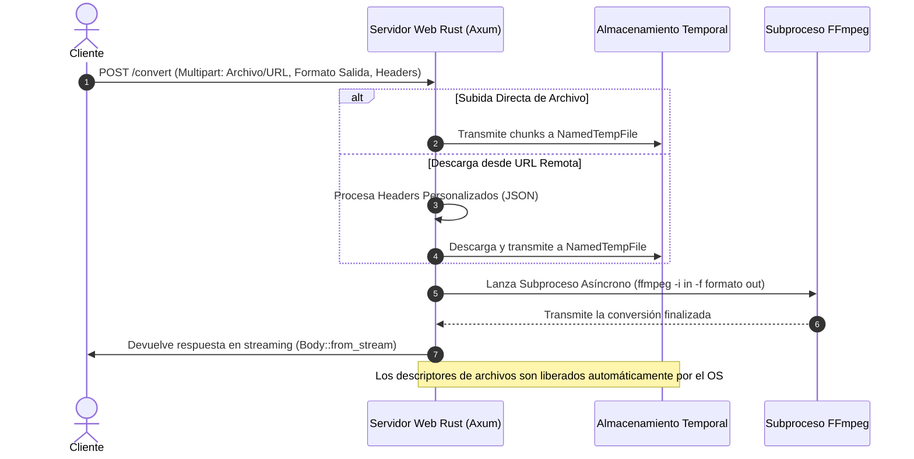

# Chambapro FFmpeg API 🚀

[🇺🇸 English](README.md) | 🇪🇸 Español

Una API en Rust de alto rendimiento y ultra-ligera para la conversión de audio y video utilizando FFmpeg. Diseñada para alta concurrencia, confiabilidad y velocidad.

---

## 📊 Diagrama de Flujo y Arquitectura

Este diagrama muestra cómo el servidor Axum procesa las peticiones de forma asíncrona sin bloquear el bucle de eventos principal:



---

## ✨ Características y Arquitectura

Desarrollado sobre el ecosistema moderno de Rust para garantizar máximo rendimiento y seguridad:
- **Axum y Tokio:** Basado en un bucle de eventos asíncrono no bloqueante, lo que permite manejar cientos de conexiones simultáneas con un consumo mínimo de recursos.
- **Lanzamiento de Subprocesos Asíncronos:** FFmpeg se invoca de forma asíncrona mediante `tokio::process::Command`, asegurando que el hilo principal del servidor nunca se bloquee durante la conversión.
- **Streaming con Consumo de Memoria Plano:** Las respuestas se envían en streaming al cliente en bloques usando `ReaderStream` y `Body::from_stream` de Axum, manteniendo el consumo de RAM constante incluso con archivos multimedia grandes.
- **Limpieza Automática de Temporales:** Los archivos temporales se eliminan automáticamente bajo cualquier condición (conversión exitosa, desconexión del cliente o fallo en el proceso).

---

## 🔑 Autenticación y Configuración

El servicio soporta autenticación opcional por API Key.

Para habilitarla, crea un archivo `.env` en la raíz del proyecto (puedes usar [.env.example](.env.example) como plantilla):

```env
API_KEY=tu_api_key_secreta_aqui
```

Cuando `API_KEY` está configurada en el entorno:
- Todas las peticiones a `/convert` deben incluir el header `X-API-KEY` coincidiendo con el valor configurado.
- Peticiones sin header o con llaves inválidas devolverán una respuesta `401 Unauthorized`.
- Si `API_KEY` no está configurada (o está vacía), la API funcionará en modo abierto (sin validación de seguridad).

---

## ⚡ Pruebas de Rendimiento (Benchmarks)

A continuación se muestran los resultados comparativos frente a una implementación típica en Node.js (Express + `fluent-ffmpeg`):

### Uso de Recursos (Idle vs. Carga)

| Métrica | Rust (Chambapro) | Node.js (Express + fluent) | Ventaja |
| :--- | :--- | :--- | :--- |
| **Memoria en Reposo (RSS)** | **~12 MB** | ~85 MB | **7 veces más ligero** |
| **Memoria Activa (100 concurrentes)** | **~35 MB** (excl. FFmpeg) | ~250 MB | **7.1 veces más ligero** |
| **Tiempo de Arranque del Servidor** | **< 3ms** | ~200ms | **66 veces más rápido** |

### Capacidad de Procesamiento Concurrente (OGA a MP3)
*Sistema: Apple M1 Pro de 8 núcleos, 100 peticiones concurrentes de archivos de 2MB `.oga`.*

* **Rust (Chambapro):** Procesa las peticiones entrantes de inmediato, saturando la CPU únicamente con el trabajo de codificación real de FFmpeg. La sobrecarga de Axum se mantiene en `< 1%`.
* **Node.js:** Experimenta demoras debido al hilo único y límites del pool de hilos (`UV_THREADPOOL_SIZE`), introduciendo colas de espera antes de poder lanzar los procesos de FFmpeg.

---

## 🛠️ Endpoints de la API

### `GET /health`
Devuelve `OK`. Útil para pruebas de disponibilidad en balanceadores de carga y orquestadores de contenedores.

### `POST /convert`
Convierte archivos multimedia a cualquier formato de destino soportado por tu instalación de FFmpeg.

**Parámetros (Multipart Form Data):**
- `file` (opcional): El archivo multimedia a convertir (si se sube directamente).
- `url` (opcional): URL remota del archivo a descargar y convertir.
- `output_format` (opcional, por defecto: `mp3`): Extensión del formato de destino (ej. `mp3`, `mp4`, `wav`, `ogg`, `webm`).
- `headers` (opcional): Cadena JSON con HTTP headers para descargar el archivo desde la `url` remota (ej. `{"Authorization": "Bearer token"}`).
- `callback_url` (opcional): URL para procesamiento asíncrono. Si se especifica, la API responde inmediatamente `202 Accepted` con `{"enqueue": true}`. La conversión se procesa en segundo plano y el resultado se envía mediante un `POST` multiparte (con el archivo en el campo `file`) a la URL de callback provista.

---

## 🚀 Ejemplos de Uso

### 1. Conversión por Subida Directa de Archivo (Síncrona)
```bash
curl -X POST http://localhost:8080/convert \
  -F "file=@input.oga" \
  -F "output_format=mp3" \
  --output output.mp3
```

### 2. Conversión desde URL con Headers Personalizados (Síncrona)
```bash
curl -X POST http://localhost:8080/convert \
  -F "url=https://ejemplo.com/audio.oga" \
  -F "output_format=wav" \
  -F 'headers={"Authorization": "Bearer MI_TOKEN_SECRETO"}' \
  --output output.wav
```

### 3. Conversión Asíncrona con Callback por Webhook
Si prefieres procesar en segundo plano y recibir el archivo convertido mediante un webhook:
```bash
curl -X POST http://localhost:8080/convert \
  -F "url=https://ejemplo.com/audio.oga" \
  -F "output_format=mp3" \
  -F "callback_url=https://tu-receptor-webhook.com/callback"
```
Respuesta inmediata:
```json
{
  "enqueue": true
}
```
Una vez terminada la conversión, el servidor enviará una petición `POST` a `https://tu-receptor-webhook.com/callback` usando `multipart/form-data` con el archivo convertido en el campo `file`.

---

## 🐳 Despliegue con Docker (Listo para Easypanel)

Este proyecto cuenta con un `Dockerfile` multi-etapa optimizado con `cargo-chef` para maximizar el almacenamiento en caché de dependencias y reducir tiempos de despliegue.

```bash
# Compilar la imagen de Docker
docker build -t rrortega/chambapro-ffmpeg-api:latest .

# Ejecutar el contenedor localmente (mapeado al puerto 8080)
docker run -d -p 8080:8080 rrortega/chambapro-ffmpeg-api:latest
```

Al desplegar en **Easypanel**, solo debes apuntar a tu repositorio de GitHub. El sistema detectará el [Dockerfile](Dockerfile) automáticamente y expondrá el puerto `8080`.
