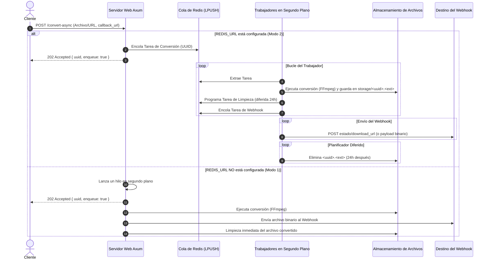

# Chambapro FFmpeg API 🚀

[🇺🇸 English](README.md) | 🇪🇸 Español

Una API en Rust de alto rendimiento y ultra-ligera para la conversión de audio y video utilizando FFmpeg. Diseñada para alta concurrencia, confiabilidad y escala.

---

## 📊 Diagrama de Flujo y Arquitectura

Este diagrama muestra cómo se procesan las peticiones asíncronas, encolándose en Redis y distribuyéndose a los trabajadores en segundo plano:



---

## ✨ Características y Arquitectura

Desarrollado sobre el ecosistema moderno de Rust para garantizar máximo rendimiento y seguridad:
- **Cola Opcional en Redis:** Si se configura `REDIS_URL`, la API opera como un sistema de procesamiento de tareas distribuido con mecanismos de reintento, límites de trabajadores, programación diferida de tareas y almacenamiento local de archivos.
- **División Asíncrona / Síncrona:** 
  - `/convert` maneja peticiones síncronas (devuelve el archivo directamente). Bloqueado si se envía un `callback_url`.
  - `/convert-async` maneja peticiones asíncronas (requiere `callback_url` y responde de inmediato con el estado de la cola).
- **Mecanismo de Reintento Automático:** Las conversiones que fallen dentro de la cola de Redis se reintentarán automáticamente hasta `MAX_RETRIES` (por defecto: 3) antes de reportar el fallo al webhook.
- **Tarea de Limpieza Automática:** Los archivos procesados se guardan localmente y se eliminan automáticamente después de `CLEANUP_HOURS` (por defecto: 24h) mediante sets ordenados diferidos en Redis.
- **Streaming Eficiente sin Consumo de RAM:** Los archivos se transmiten al cliente o webhook en bloques mediante `ReaderStream` para mantener el uso de memoria bajo y plano.

---

## 🔑 Autenticación y Configuración

El servicio soporta autenticación opcional por API Key y personalización mediante variables de entorno.

Crea un archivo `.env` en la raíz del proyecto (puedes usar [.env.example](.env.example) como plantilla):

```env
PORT=8080
RUST_LOG=info

# (Opcional) Protección por API Key. Si se define, las peticiones deben incluir el header 'X-API-KEY'.
API_KEY=tu_api_key_secreta_aqui

# (Opcional) Cadena de conexión de Redis. Activa la cola asíncrona avanzada.
REDIS_URL=redis://127.0.0.1:6379

# (Opcional) Configuraciones del Worker
MAX_RETRIES=3
CLEANUP_HOURS=24
STORAGE_DIR=./storage
HOST_URL=http://localhost:8080
```

---

## 🛠️ Endpoints de la API

### `GET /health`
Devuelve `OK`. Útil para pruebas de disponibilidad en balanceadores de carga y orquestadores de contenedores.

### `POST /convert`
Realiza una conversión **síncrona**. Devuelve el archivo convertido directamente en el cuerpo de la respuesta HTTP.
*Nota: Devuelve `400 Bad Request` si se proporciona un `callback_url`.*

### `POST /convert-async`
Realiza una conversión **asíncrona** (requiere `callback_url`). Devuelve inmediatamente `202 Accepted` con `{ "uuid": "...", "enqueue": true }`.

**Parámetros (Multipart Form Data):**
- `file` (opcional): El archivo multimedia a convertir.
- `url` (opcional): URL remota del archivo multimedia a descargar.
- `output_format` (opcional, por defecto: `mp3`): Extensión del formato de destino (ej. `mp3`, `mp4`, `wav`).
- `headers` (opcional): Headers JSON personalizados para descargar desde la `url` remota.
- `callback_url` (requerido): URL de webhook a la cual notificar al finalizar el proceso.
- `include_file` (opcional, por defecto: `false`): Si es `true`, el webhook recibirá el archivo binario completo. Si es `false`, el webhook recibirá un JSON con el enlace de descarga.

### `GET /download/:file_name`
Descarga un archivo convertido del almacenamiento (ej. `/download/<uuid>.mp3`). Devuelve un error limpio si el archivo ya fue eliminado o no existe.

---

## 🚀 Ejemplos de Uso

### 1. Conversión Síncrona
```bash
curl -X POST http://localhost:8080/convert \
  -F "file=@input.oga" \
  -F "output_format=mp3" \
  --output output.mp3
```

### 2. Cola Asíncrona (Webhook con Enlace de Descarga)
```bash
curl -X POST http://localhost:8080/convert-async \
  -F "url=https://ejemplo.com/audio.oga" \
  -F "output_format=mp3" \
  -F "callback_url=https://tu-webhook.com/callback"
```
Respuesta:
```json
{
  "uuid": "7a94dfbd-5b0c-4464-9b2f-3b2d6a5c2f9d",
  "enqueue": true
}
```

---

## 🐳 Despliegue con Docker (Listo para Easypanel)

Este proyecto cuenta con un `Dockerfile` multi-etapa optimizado con `cargo-chef` para maximizar el almacenamiento en caché de dependencias y reducir tiempos de despliegue.

Al desplegar en **Easypanel**, solo debes apuntar a tu repositorio de GitHub. El sistema detectará el [Dockerfile](Dockerfile) automáticamente y expondrá el puerto `8080`. No olvides enlazar un servicio de Redis e inyectar `REDIS_URL` en las variables de entorno.
