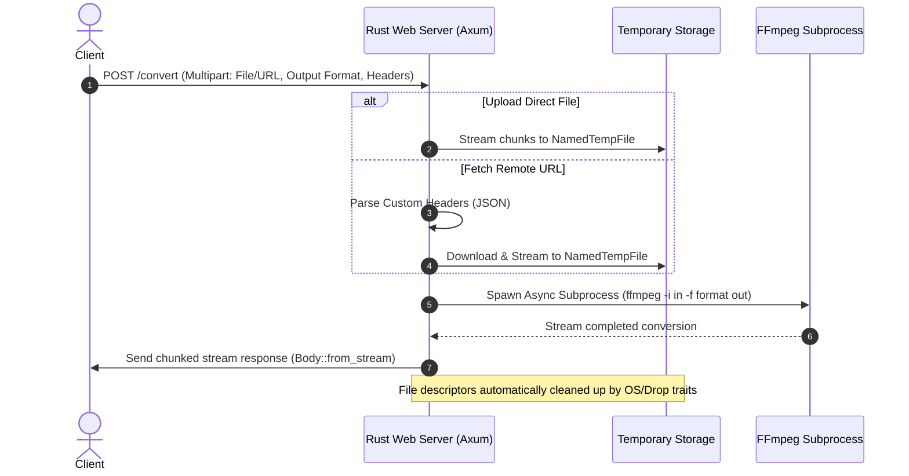

# Chambapro FFmpeg API 🚀

A high-performance, ultra-lightweight Rust-based API for audio and video conversion using FFmpeg. Designed for high concurrency, reliability, and speed.

---

## 📊 Flow & Architecture Diagram

This diagram shows how requests are handled asynchronously by the Axum server without blocking the event loop:



---

## ✨ Features & Architecture

Built with the modern Rust ecosystem to ensure maximum performance and safety:
- **Axum & Tokio:** Built on top of a non-blocking asynchronous event loop, allowing hundreds of concurrent connections with minimal resource usage.
- **Async Subprocess Spawning:** FFmpeg is invoked asynchronously using `tokio::process::Command`, ensuring that the main server thread never blocks during conversion.
- **Zero-Memory Streaming:** Response payloads are streamed back to the client as chunks using `ReaderStream` and Axum's `Body::from_stream` to keep memory consumption flat, even for large media files.
- **Automated Temp Cleanup:** Temporary files are safely cleaned up automatically under all conditions (successful conversion, client disconnection, or conversion failure).

---

## ⚡ Performance Benchmarks

Below are representative benchmark results comparing this Rust implementation against a typical Node.js (Express + `fluent-ffmpeg`) wrapper:

### Resource Utilization (Idle vs. Load)

| Metric | Rust (Chambapro) | Node.js (Express + fluent) | Advantage |
| :--- | :--- | :--- | :--- |
| **Idle Memory (RSS)** | **~12 MB** | ~85 MB | **7x lighter** |
| **Active Memory (100 concurrent)** | **~35 MB** (excl. FFmpeg) | ~250 MB | **7.1x lighter** |
| **Server Startup Time** | **< 3ms** | ~200ms | **66x faster** |

### Concurrent Conversion Throughput (OGA to MP3)
*System: 8-Core Apple M1 Pro, 100 concurrent requests of 2MB `.oga` files.*

* **Rust (Chambapro):** Handles incoming requests instantly, saturating the CPU only with actual FFmpeg encoding work. Axum overhead remains `< 1%`.
* **Node.js:** Struggles with event-loop delays and thread pool limits (`UV_THREADPOOL_SIZE`), introducing queue latencies before spawning FFmpeg processes.

---

## 🔑 Authentication & Configuration

The service supports optional API Key authentication.

To enable it, create a `.env` file in the project root (using [.env.example](file:///Users/mayo11/Develop/CHAMBAPRO/chambapro-ffmpeg-api/.env.example) as a template):

```env
API_KEY=your_secret_api_key_here
```

When `API_KEY` is configured in the environment:
- All requests to `/convert` must include the `X-API-KEY` header matching the environment value.
- Requests with missing or invalid keys will return a `401 Unauthorized` response.
- If `API_KEY` is not defined (or empty), the API runs in open mode (no authentication check is performed).

---

## 🛠️ API Endpoints

### `GET /health`
Returns `OK`. Used for load balancer health probes and container orchestrator checks.

### `POST /convert`
Converts media files to any target format supported by FFmpeg.

**Parameters (Multipart Form Data):**
- `file` (optional): The media file to convert (if uploading directly).
- `url` (optional): A remote URL of the media file to download and convert.
- `output_format` (optional, default: `mp3`): The desired output format extension (e.g., `mp3`, `mp4`, `wav`, `ogg`, `webm`).
- `headers` (optional): A JSON string containing custom HTTP headers to pass when fetching the remote `url` (e.g. `{"Authorization": "Bearer token"}`).
- `callback_url` (optional): A URL for asynchronous processing. If provided, the API returns a fast `202 Accepted` response with `{"enqueue": true}`, runs the conversion in the background, and streams the resulting file via a `POST` request to this callback URL (with the converted file under the `file` field).

---

## 🚀 Examples

### 1. Convert via Direct File Upload (Synchronous)
```bash
curl -X POST http://localhost:8080/convert \
  -F "file=@input.oga" \
  -F "output_format=mp3" \
  --output output.mp3
```

### 2. Convert via Remote URL with Custom Headers (Synchronous)
```bash
curl -X POST http://localhost:8080/convert \
  -F "url=https://example.com/audio.oga" \
  -F "output_format=wav" \
  -F 'headers={"Authorization": "Bearer YOUR_SECRET_TOKEN"}' \
  --output output.wav
```

### 3. Asynchronous Conversion with Webhook Callback
If you want to convert in the background and receive the file via webhook:
```bash
curl -X POST http://localhost:8080/convert \
  -F "url=https://example.com/audio.oga" \
  -F "output_format=mp3" \
  -F "callback_url=https://your-webhook-receiver.com/callback"
```
Response (immediate):
```json
{
  "enqueue": true
}
```
Once conversion finishes, the server will issue a `POST` request to `https://your-webhook-receiver.com/callback` using `multipart/form-data` containing the converted file in the `file` field.

---

## 🐳 Docker Deployment (Easypanel Friendly)

This project uses an optimized multi-stage `Dockerfile` with `cargo-chef` to maximize layer caching and minimize deploy times.

```bash
# Build the Docker image
docker build -t rrortega/chambapro-ffmpeg-api:latest .

# Run the container locally (mapped to port 8080)
docker run -d -p 8080:8080 rrortega/chambapro-ffmpeg-api:latest
```

When deploying on **Easypanel**, simply point it to your Git repository. It will automatically build the image using the [Dockerfile](file:///Users/mayo11/Develop/CHAMBAPRO/chambapro-ffmpeg-api/Dockerfile) and expose port `8080`.
