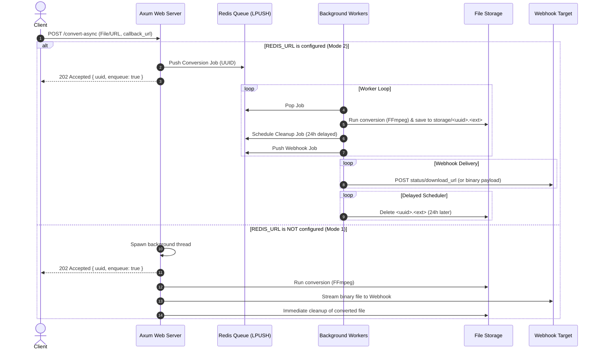

# Chambapro FFmpeg API 🚀

🇺🇸 English | [🇪🇸 Español](README.es.md)

A high-performance, ultra-lightweight Rust-based API for audio and video conversion using FFmpeg. Designed for high concurrency, reliability, and scale.

---

## 📊 Flow & Architecture Diagram

This diagram shows how asynchronous requests are handled, queued in Redis, and distributed to background workers:



---

## ✨ Features & Architecture

Built with the modern Rust ecosystem to ensure maximum performance and safety:
- **Optional Redis Queue:** If `REDIS_URL` is set, the API operates as a distributed job processing system with retry mechanisms, worker limits, delayed task scheduling, and disk caching.
- **Asynchronous / Synchronous Split:** 
  - `/convert` handles synchronous requests (returns file directly). Blocked if `callback_url` is passed.
  - `/convert-async` handles asynchronous requests (requires `callback_url` and returns immediate queue status).
- **Auto-retry Mechanism:** Conversions failing inside the Redis queue automatically retry up to `MAX_RETRIES` (default: 3) before reporting failure to the webhook.
- **Auto-cleanup Job:** Processed files are cached in a local storage directory and automatically removed after `CLEANUP_HOURS` (default: 24h) via Redis delayed sorted sets.
- **MIME & Zero-Copy Streaming:** Files are streamed chunk-by-chunk to the client or webhook via `ReaderStream` to keep RAM usage flat.

---

## 🔑 Authentication & Configuration

The service supports optional API Key authentication and environment customization.

Create a `.env` file in the project root (using [.env.example](.env.example) as a template):

```env
PORT=80
RUST_LOG=info

# (Optional) API Key protection. If set, requests must include the 'X-API-KEY' header.
API_KEY=your_secret_api_key_here

# (Optional) Redis Connection string. Activates the advanced asynchronous queue.
REDIS_URL=redis://127.0.0.1:6379

# (Optional) Worker settings
MAX_RETRIES=3
CLEANUP_HOURS=24
STORAGE_DIR=./storage
PUBLIC_URL=http://localhost

# (Optional) OpenTelemetry (OTel) Configuration
OTEL_EXPORTER_OTLP_ENDPOINT=http://localhost:4318
TELEMETRY_API_KEY=your_telemetry_tool_api_key
```

---

## 🛠️ API Endpoints

### `GET /`
Redirects automatically to `/docs` for immediate documentation access.

### `GET /docs`
Serves the interactive Swagger UI API documentation (OpenAPI 3.0 specification).

### `GET /health`
Returns `OK`. Used for load balancer health probes and container orchestrator checks.

### `POST /convert`
Performs **synchronous** conversion. Returns the converted file directly in the HTTP response body.
*Note: Returns `400 Bad Request` if a `callback_url` is supplied.*

### `POST /convert-async`
Performs **asynchronous** conversion (requires `callback_url`). Returns `202 Accepted` with `{ "uuid": "...", "enqueue": true }` immediately.

**Parameters (Multipart Form Data):**
- `file` (optional): The media file to convert.
- `url` (optional): A remote URL of the media file to download.
- `output_format` (optional, default: `mp3`): Target format extension (e.g. `mp3`, `mp4`, `wav`).
- `headers` (optional): Custom JSON headers to fetch the remote `url`.
- `callback_url` (required): Webhook endpoint to notify upon completion.
- `include_file` (optional, default: `false`): If `true`, the webhook sends the full binary file. If `false`, the webhook receives a success JSON containing the download link.

### `GET /download/:file_name`
Downloads a converted file from storage (e.g. `/download/<uuid>.mp3`). Returns a clean error if the file has been cleaned up.

### `GET /dashboard`
Serves a beautiful, real-time web dashboard displaying current queue metrics (total, pending, success, failed), live job updates, and scrolling stdout process logs.

### `POST /admin/cleanup`
Manually triggers a file cleanup scan in `STORAGE_DIR`, removing any uploaded or converted files older than `CLEANUP_HOURS`. (Guarded by `X-API-KEY` if enabled).

---

## 🚀 Examples

### 1. Synchronous File Upload
```bash
curl -X POST http://localhost/convert \
  -F "file=@input.oga" \
  -F "output_format=mp3" \
  --output output.mp3
```

### 2. Asynchronous Queue (Download Link Webhook)
```bash
curl -X POST http://localhost/convert-async \
  -F "url=https://example.com/audio.oga" \
  -F "output_format=mp3" \
  -F "callback_url=https://your-webhook.com/callback"
```
Response:
```json
{
  "uuid": "7a94dfbd-5b0c-4464-9b2f-3b2d6a5c2f9d",
  "enqueue": true
}
```

---

## 🐳 Docker Deployment (Easypanel Friendly)

This project uses an optimized multi-stage `Dockerfile` with `cargo-chef` to maximize caching and minimize deploy times.

On **Easypanel**, simply point it to your Git repository. It will automatically build the image using the [Dockerfile](Dockerfile) and expose port `80`. Don't forget to link a Redis service and inject `REDIS_URL` in the environment variables.

---

## 📈 Scalability & Volume Mapping

When deploying this API in a clustered or multi-instance environment (e.g., Kubernetes, Docker Swarm, multiple Docker containers behind Traefik/Nginx, or cloud platforms):

### 1. Horizontal Autoscaling (Producer-Consumer)
- The asynchronous `/convert-async` endpoint acts as a **Producer**, inserting tasks into Redis.
- Background workers in each container act as **Consumers**, fetching tasks atomically using Redis operations.
- You can scale the web API containers horizontally to handle high request concurrency, and scale the background processing workers independently.

### 2. Shared Storage Requirement (CRITICAL)
- **Problem**: When a worker container processes a conversion, it writes the output file to its local `STORAGE_DIR`. If a client makes a `GET /download/:file_name` request, the load balancer may route it to a different container that does not have the file, resulting in a `404 Not Found` error.
- **Solution**: You **must** configure `STORAGE_DIR` to point to a **shared storage volume** mounted by all instances.
  - **Docker Compose**: Use a shared named volume or host-bind mount.
  - **Kubernetes**: Mount a `PersistentVolumeClaim` with `ReadWriteMany` (RWX) access mode (e.g., using NFS, AWS EFS, or Ceph).
  - **Easypanel / Cloud providers**: Map a shared persistent directory or network drive across your app instances.

---

## 👤 Author & Contributor

This project was designed, architected, and implemented by:

* **Rolando Rodriguez Ortega**
  * GitHub: [@rrortega](https://github.com/rrortega)
  * Email: rolymayo11@gmail.com

Feel free to open issues, submit pull requests, or leave a ⭐️ on the repository if this project was helpful to you!

